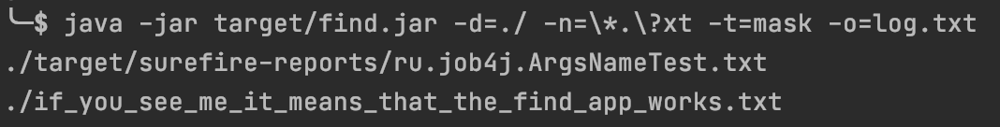

# job4j_utilities

This project represents a set of utilities:

### 1. Zip archiver
This utility can archive a directory including its files and subdirectories but excluding all files of type indicated in the key `-e`.

Usage example:

    java -jar pack.jar -d=../job4j_utilities -e=.class -o=project.zip

Keys:

- `java -jar pack.jar` - jar file of this utility
- `d` - path to directory to archive
- `e` - file type to exclude
- `o` - output zip file

:bulb: To create `pack.jar` file use command below:

    mvn install -Ppack
---
### 2. File finder
This utility finds data in the indicated directory and subdirectories.
The file name can be given entirely, by mask or by regular expression.

Usage example:

    java -jar find.jar -d=c:/ -n=\*.\?xt -t=mask -o=log.txt

Keys:

- `java -jar pack.jar` - jar file of this utility
- `d` - path to directory to search in
- `n` - file name, mask or regular expression
- `t` - search type:
  - `mask` - search by mask
  - `name` - search by full match
  - `regex` - search by regular expression.
- `o` - write the result to a file.

:bulb: To create `find.jar` file use command below:

    mvn install -Pfind
---

### Used technologies:
- IO/NIO for connection with file system
- JUnit for testing
- Slf4j for logging

